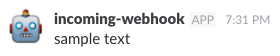

# slack-incoming-webhooks-ruby

Ruby Client of Slack Incoming webhooks.

About Slack incoming-webhooks
- [slack incoming webhooks](https://api.slack.com/incoming-webhooks)

## Installation

Add this line to your application's Gemfile:

```ruby
gem 'slack-incoming-webhooks-ruby'
```

## Usage

### Setting Incoming webhooks

Start by setting up an [incoming webhook integration](https://my.slack.com/services/new/incoming-webhook/) in your Slack team.

### Post to slack

#### normal post

```ruby
require 'slack-incoming-webhooks-ruby'

url = ENV['SLACK_WEBHOOK_URL']
slack = Slack::IncomingWebhooks::Client.new(url)

payload = Slack::Messages::Payload.new
payload.text = 'sample text'
slack.post(payload)
```



#### with attachment

```ruby
require 'slack-incoming-webhooks-ruby'

url = ENV['SLACK_WEBHOOK_URL']
slack = Slack::IncomingWebhooks::Client.new(url)
payload = Slack::Messages::Payload.new
attachment = Slack::Messages::Attachment.new
attachment.fallback = 'sample fallback'
attachment.color = 'good'
attachment.title = 'sample title'
attachment.footer = 'from sample'
payload.attachments = [attachment]

slack.post(payload)
```

TODO: image

#### with field

```ruby
require 'slack-incoming-webhooks-ruby'

url = ENV['SLACK_WEBHOOK_URL']
slack = Slack::IncomingWebhooks::Client.new(url)
payload = Slack::Messages::Payload.new
attachment = Slack::Messages::Attachment.new
attachment.fallback = 'sample fallback'
attachment.color = 'good'
attachment.title = 'sample title'
attachment.footer = 'from sample'

field = Slack::Messages::Field.new
field.title = "sample field"
field.value = 'http://github.com'

field2 = Slack::Messages::Field.new
field2.title = "sample field2"
field2.value = 'http://github2.com'

attachment.fields = [field, field2]
payload.attachments = [attachment]

slack.post(payload)
```

TODO: image

## TODO

- [ ] spec
- [ ] CI

## Development

After checking out the repo, run `bin/setup` to install dependencies. Then, run `rake spec` to run the tests. You can also run `bin/console` for an interactive prompt that will allow you to experiment.

To install this gem onto your local machine, run `bundle exec rake install`. To release a new version, update the version number in `version.rb`, and then run `bundle exec rake release`, which will create a git tag for the version, push git commits and tags, and push the `.gem` file to [rubygems.org](https://rubygems.org).

## License

The gem is available as open source under the terms of the [MIT License](http://opensource.org/licenses/MIT).

## Code of Conduct

Everyone interacting in the Slack::IncomingWebhooks::Client project’s codebases, issue trackers, chat rooms and mailing lists is expected to follow the [code of conduct](https://github.com/naoto0822/slack-incoming-webhooks-ruby/blob/master/CODE_OF_CONDUCT.md).
